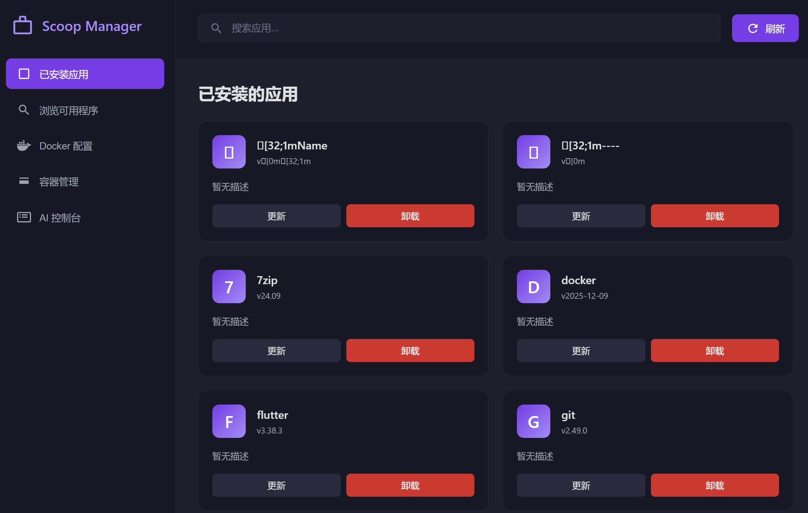

# Scoop Manager

<div align="center">


一个现代化的 Scoop 包管理器可视化工具，基于 Electron 构建

[功能特性](#功能特性) • [安装](#安装) • [使用](#使用) • [截图](#截图) • [技术栈](#技术栈)

</div>

---

## ✨ 功能特性

### 📦 应用管理
- 🔍 **智能搜索** - 实时搜索已安装和可用的应用程序
- ⬇️ **一键安装** - 快速安装 Scoop 仓库中的应用
- 🗑️ **轻松卸载** - 安全卸载不需要的应用
- 🔄 **快速更新** - 更新已安装的应用到最新版本
- 📊 **进度显示** - 安装/更新/卸载过程实时进度条

### 🐳 Docker 集成
- ⚙️ **资源配置** - 调整 Docker 的磁盘、内存、CPU 配额
- 🚀 **服务控制** - 启动、停止、重启 Docker 服务
- 📡 **状态监控** - 实时显示 Docker 运行状态
- 📦 **容器管理** - 可视化管理 Docker 容器（启动/停止/删除）
- 🔄 **自动刷新** - 容器状态每30秒自动更新
- 🌐 **镜像加速** - 配置中国地区镜像加速源
  - 中科大镜像
  - 网易镜像
  - 腾讯云镜像
  - Docker 中国镜像
  - DockerProxy

### 🎨 用户界面
- 🌙 **深色主题** - 护眼的深色配色方案
- 💜 **紫色主题** - 现代化的紫色渐变设计
- 📱 **响应式布局** - 适配不同屏幕尺寸
- ⚡ **流畅动画** - 丝滑的交互体验
- 🔔 **系统托盘** - 窗口关闭自动最小化到系统托盘
- 🎯 **托盘控制** - 右键菜单和点击切换窗口显示

### 🤖 AI 助手
- � **智能控制i台** - 通过自然语言生成系统命令
- ⚙️ **可配置端点** - 支持自定义 AI 模型端点和 API Key
- 📝 **提示词模板** - 可自定义的命令生成模板
- 🎯 **安全执行** - 智能过滤危险命令，确保系统安全
- 🚀 **快捷命令** - 预设常用系统查询命令

### 💾 数据管理
- 🗄️ **SQLite 数据库** - 本地存储应用信息
- 💿 **配置持久化** - 保存用户配置和偏好设置

## 📥 安装

### 前置要求

- **Windows 系统** (Windows 10/11)
- **Node.js** (v16 或更高版本)
- **Scoop** 包管理器

如果还未安装 Scoop，请在 PowerShell 中运行：

```powershell
Set-ExecutionPolicy RemoteSigned -Scope CurrentUser
irm get.scoop.sh | iex
```

### 安装步骤

1. **克隆仓库**
```bash
git clone https://github.com/你的用户名/scoop-manager.git
cd scoop-manager
```

2. **安装依赖**
```bash
npm install
```

3. **运行应用**
```bash
npm start
```

## 🚀 使用

### 已安装应用
- 查看所有通过 Scoop 安装的应用
- 点击"更新"按钮更新应用
- 点击"卸载"按钮移除应用
- 使用搜索框快速查找应用

### 浏览可用程序
- 浏览 Scoop 仓库中的可用应用
- 点击"安装"按钮快速安装
- 支持搜索过滤

### Docker 配置
- 仅在安装 Docker 后显示
- 调整资源配置（磁盘、内存、CPU）
- 选择镜像加速源
- 控制 Docker 服务（停止/重启）
- 实时查看 Docker 状态

### Docker 容器管理
- 查看所有容器状态（运行中/已停止）
- 启动、停止、删除容器操作
- 容器信息详细显示（镜像、端口、创建时间等）
- 自动刷新容器状态

### AI 控制台
- 输入自然语言问题，AI 生成对应的系统命令
- 配置 AI 端点、模型、API Key
- 自定义提示词模板
- 安全的命令执行环境
- 快捷命令按钮（系统信息、Docker 容器、网络配置等）

### 系统托盘
- 关闭窗口自动最小化到系统托盘
- 紫色方块托盘图标
- 右键菜单：显示/隐藏窗口、退出应用
- 点击托盘图标切换窗口显示状态

## 📸 截图

> 添加应用截图

## 🛠️ 技术栈

- **[Electron](https://www.electronjs.org/)** - 跨平台桌面应用框架
- **[better-sqlite3](https://github.com/WiseLibs/better-sqlite3)** - 高性能 SQLite 数据库
- **原生 JavaScript** - 无需额外框架，轻量高效
- **CSS3** - 现代化 UI 设计

## 📁 项目结构

```
scoop-manager/
├── main.js              # Electron 主进程
├── preload.js           # 预加载脚本
├── renderer.js          # 渲染进程逻辑
├── index.html           # 主界面
├── styles.css           # 样式文件
├── build-icon.js        # 托盘图标生成脚本
├── create-tray-icon.js  # 托盘图标创建工具
├── tray-icon.ico        # 系统托盘图标
├── package.json         # 项目配置
└── README.md           # 项目说明
```

## 🔧 开发

### 开发模式
```bash
npm start
```

### 构建应用
```bash
npm run build
```

## 🤝 贡献

欢迎提交 Issue 和 Pull Request！

1. Fork 本仓库
2. 创建特性分支 (`git checkout -b feature/AmazingFeature`)
3. 提交更改 (`git commit -m 'Add some AmazingFeature'`)
4. 推送到分支 (`git push origin feature/AmazingFeature`)
5. 开启 Pull Request

## 📝 更新日志

### v1.1.0 (最新)
- ✅ 添加系统托盘功能
- ✅ 紫色方块托盘图标
- ✅ 托盘右键菜单和点击切换
- ✅ 更新 Docker 图标设计
- ✅ AI 控制台功能
- ✅ Docker 容器可视化管理
- ✅ 安全的命令执行环境

### v1.0.0
- ✅ 基础 Scoop 应用管理
- ✅ Docker 配置和服务控制
- ✅ 深色紫色主题
- ✅ SQLite 数据库存储

## 📝 待办事项

- [ ] 添加应用图标支持
- [ ] 支持批量操作
- [ ] 添加更新检查功能
- [ ] 支持自定义主题
- [ ] 添加应用详情页面
- [ ] 支持多语言
- [ ] 托盘气泡通知优化
- [ ] AI 命令历史记录

## 📄 许可证

本项目采用 MIT 许可证 - 查看 [LICENSE](LICENSE) 文件了解详情

## 🙏 致谢

- [Scoop](https://scoop.sh/) - 优秀的 Windows 包管理器
- [Electron](https://www.electronjs.org/) - 强大的跨平台框架

## 📮 联系方式

如有问题或建议，欢迎通过 Issue 联系我们。

---

<div align="center">

**[⬆ 回到顶部](#scoop-manager)**

Made with ❤️ by [Your Name]

</div>
